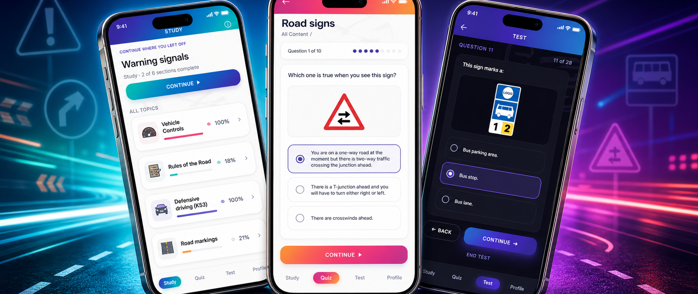

# K53 Study Guide



**K53 Study Guide** helps South African learners prepare for the learner's licence test with focused study material, quizzes, mock tests, and progress tracking.

## App Links

- [Website](https://k53studyguide.online/)
- [Google Play](https://play.google.com/store/apps/details?id=deanvniekerk.k53studyguide.app&hl=en_US)
- [App Store](https://apps.apple.com/us/app/k53-study-guide/id6784718443)

## What It Includes

- **Study**: K53 topics for road signs, road markings, road signals, rules of the road, vehicle controls, and defensive driving.
- **Quiz**: practice questions across selected topics, with saved progress.
- **Test**: full mock learner's licence tests across the same broad sections used in the learner's licence test.
- **Progress tracking**: study completion, quiz progress, and test history.
- **Landing site**: a static marketing/support website with privacy and terms pages.

K53 Study Guide is an independent study app. It is not affiliated with, endorsed by, authorised by, or acting on behalf of any government entity, and it does not provide official bookings, applications, licences, services, or test results.

## License / Use

No license is granted for this repository. The source is public for portfolio/reference review only. All rights are reserved; do not copy, use, modify, redistribute, or reuse any part without written permission.

## Repository

This is a pnpm monorepo with packages under `pkg/*`.

- `pkg/app`: Ionic React + Capacitor mobile app.
- `pkg/shared`: shared K53 content, quiz logic, and React UI pieces.
- `pkg/lander`: Vite static landing website.
- `assets`: store and README media.
- `scripts`: release and deployment helpers.

## Local Development

Install dependencies:

```bash
pnpm install
```

Run the mobile app web shell:

```bash
pnpm start
```

The app dev server runs at `http://localhost:3000`.

Run the landing website:

```bash
pnpm lander:start
```

The lander uses Vite's default dev port, usually `http://localhost:5173`.

## Environment

Copy the example env file when you need local deploy or purchase credentials:

```bash
cp .dev.env.example .dev.env
```

The real `.dev.env` file is ignored by git. Commit only `.dev.env.example`.

Useful values:

- `FTP_PASSWORD`: required for `pnpm lander:deploy`.
- `FTP_REMOTE_DIR`: use `.` when the FTP account lands in the site root; otherwise use the hosting folder such as `public_html`.
- `REVENUECAT_ANDROID_API_KEY` / `REVENUECAT_IOS_API_KEY`: used by the app build.

## Quality Checks

Run the main validation commands:

```bash
pnpm lint
pnpm test
pnpm build
pnpm lander:build
```

Other useful commands:

```bash
pnpm test:watch
pnpm test:coverage
pnpm lint-fix
pnpm --filter app analyze:build
pnpm --filter app analyze:run
```

## Landing Site

Build the landing website:

```bash
pnpm lander:build
```

Deploy the normal landing site build:

```bash
pnpm lander:deploy
```

The default deploy skips the large quiz image asset tree. Use the full deploy only when those assets need to be uploaded:

```bash
pnpm lander:deploy:full
```

## Native Builds

Firebase native config files are not committed. For local native builds, copy your own Firebase config into:

- `pkg/app/android/app/google-services.json`
- `pkg/app/ios/App/App/GoogleService-Info.plist`

Azure Pipelines restores these from secure files during Android/iOS release builds. The secure file names must be:

- `google-services.json`
- `GoogleService-Info.plist`
- `upload-keystore.jks`
- `K53StudyGuide_AppleDistribution.p12`
- `K53StudyGuide_AppStore.mobileprovision`

Sync native projects:

```bash
pnpm cap-sync-android
pnpm cap-sync-ios
```

Open native projects:

```bash
pnpm cap-open-android
pnpm cap-open-ios
```

## Releasing

Bump Android and iOS native versions together:

```bash
pnpm bump:native
```

Set explicit release numbers:

```bash
pnpm bump:native -- --version 1.2 --build 38
```

The native version script updates:

- `pkg/app/android/app/build.gradle`
- `pkg/app/ios/App/App.xcodeproj/project.pbxproj`

Azure Pipelines can then build Android/iOS artifacts from `azure-pipelines.yml` using the parameterized `buildAndroid`, `buildIOS`, and `uploadIOS` flags.

## SVG To React Component Tool

```bash
pnpm --filter app svg-to-component -- assets/resources/driving-school/svg-solid/018-turn-left.svg
```
